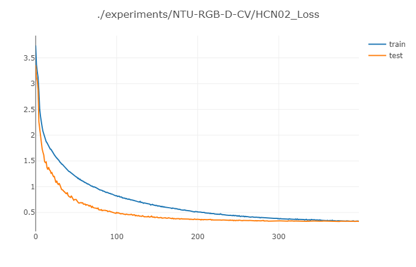
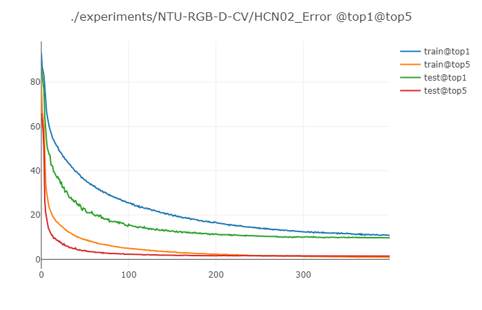
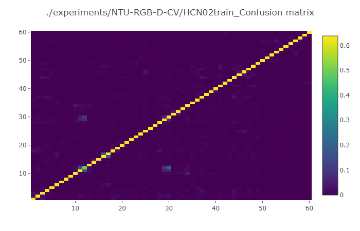
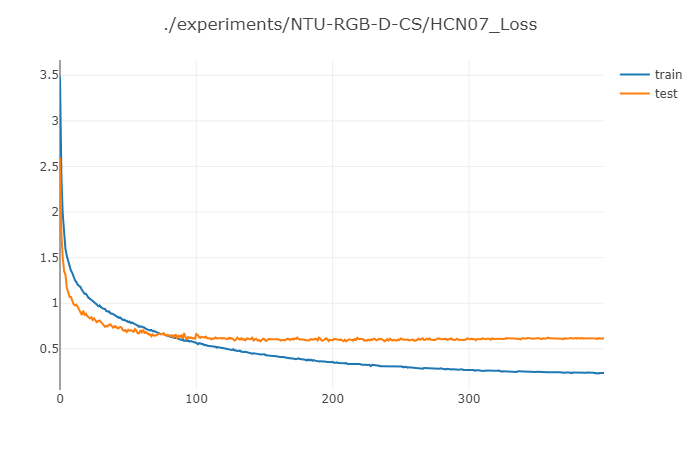
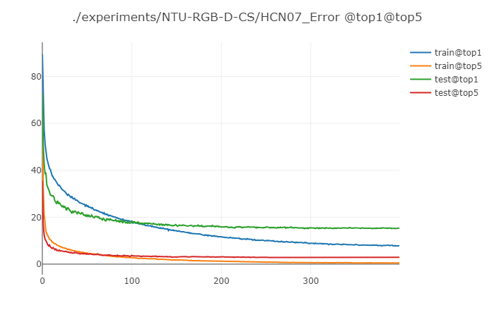

# A PyTorch Reproduction of HCN
**Co-occurrence Feature Learning from Skeleton Data for Action Recognition and Detection with Hierarchical Aggregation**.
Chao Li, Qiaoyong Zhong, Di Xie, Shiliang Pu, IJCAI 2018.

[Arxiv Preprint](http://arxiv.org/pdf/1804.06055.pdf)

## Features
#### 1. Dataset
- [x] NTU RGB+D: Cross View (CV), Cross Subject (CS)
- [ ] SBU Kinect Interaction
- [ ] PKU-MMD

#### 2. Tasks
- [x] Action recognition
- [ ] Action detection

#### 3. Visualization
- Visdom supported.

## Prerequisites
Our code is based on **Python3.5**. There are a few dependencies to run the code in the following:
- Python (>=3.5)
- PyTorch (0.4.0)
- [torchnet](https://github.com/pytorch/tnt)
- Visdom
- Other version info about some Python packages can be found in `requirements.txt`

## Usage
#### Data preparation
##### NTU RGB+D
To transform raw NTU RGB+D data into numpy array (memmap format ) by this command:
```commandline
python ./feeder/ntu_gendata.py --data_path <path for raw skeleton dataset> --out_folder <path for new dataset>
```
##### Other Datasets
Not supported now.
#### Training
Before you start the training, you have to launch [visdom](https://github.com/facebookresearch/visdom) server.
```commandline
python -m visdom
```


To train the model, you should note that:
 - ```--dataset_dir``` is the **parents path** for **all** the datasets, 
 - ``` --num ``` the number of experiments trials (type: list).
```commandline
python main.py --dataset_dir <parents path for all the datasets> --mode train --model_name HCN --dataset_name NTU-RGB-D-CV --num 01
```
To run a new trial with different parameters, you need to: 
- Firstly, run the above training command with a new trial number, e.g, ```--num 03```, thus you will got an error.
- Secondly, copy a  parameters file from the ```./HCN/experiments/NTU-RGB-D-CV/HCN01/params.json``` to the path of your new trial ```"./HCN/experiments/NTU-RGB-D-CV/HCN03/params.json"``` and modify it as you want.
- At last, run the above training command again, it will works.

#### Testing
```commandline
python main.py --dataset_dir <parents path for all the datasets> --mode test --load True --model_name HCN --dataset_name NTU-RGB-D-CV --num 01
```

#### Load and Training 
You also can load a half trained model, and start training it from a specific checkpoint by the following command:
```commandline
python main.py --dataset_dir <parents path for all the datasets> --mode load_train --load True --model_name HCN --dataset_name NTU-RGB-D-CV --num 01 --load_model <path for  trained model>
```

## Results
#### Table
The expected **Top-1** **accuracy** of the model for NTU-RGD+D are shown here (There is an **accuracy gap**. I am not the author of original HCN paper, the repo was reproduced according to the paper text and have not been tuned carefully):

| Model | Normalized <br> Sequence <br> Length | FC <br> Neuron <br> Numbers | NTU RGB+D <br>  Cross Subject (%) |NTU RGB+D <br> Cross View (%) |
| :------: | :------: | :------:| :------:| :------: |
| HCN[1]| 32 | 256 | **86.5** | **91.1** |
| HCN | 32 | 256 | 84.2 | 89.2 |
| HCN | 64 | 512 | 84.9* | 90.9* |
 
[1] http://arxiv.org/pdf/1804.06055.pdf

#### Figures
- Loss & accuracy[CV] 
<div align="center">
    
    
</div>

#### Confusion matrix

<div align="center">
    
    
</div>
- Loss & accuracy[CS] 
<div align="center">
    
    
</div>


## Reference
[1] Chao Li, Qiaoyong Zhong, Di Xie, Shiliang Pu. Co-occurrence Feature Learning from Skeleton Data for Action Recognition and Detection with Hierarchical Aggregation. IJCAI 2018.

[2] [yysijie/st-gcn](https://github.com/yysijie/st-gcn): referred for some code of dataset processing.

